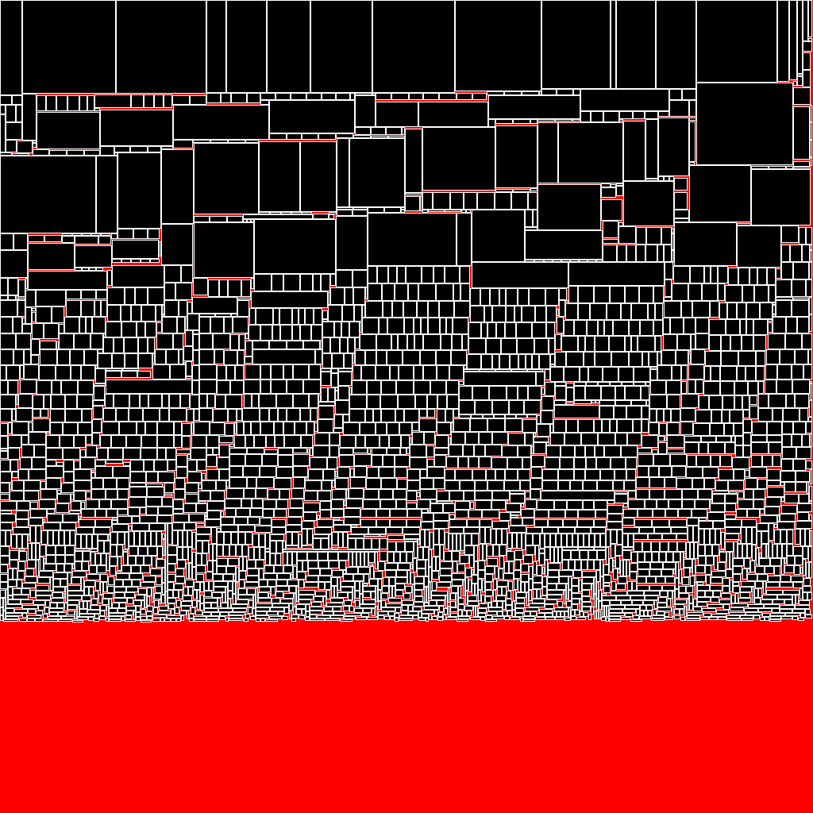
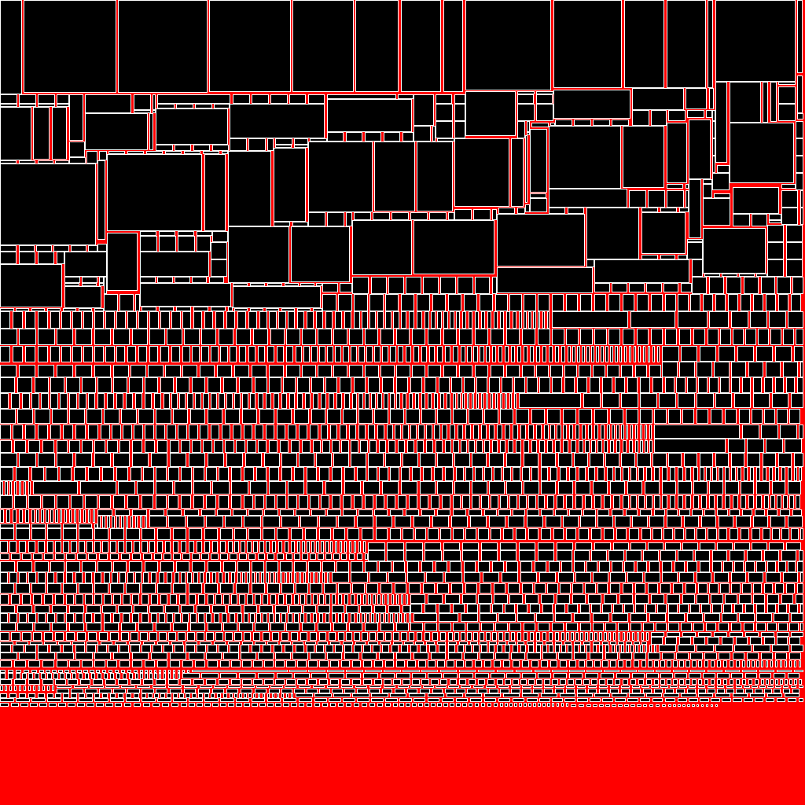

## example:
```java
Random random = new Random(46);

int count = 3000;
int[] sizes = new int[count * 2];
for (int i = 0; i < count; i++) {
    int w;
    int h;
    if (i < 90) {
        // big rectangles
        w = (random.nextInt(120) + 1);
        h = (random.nextInt(120) + 1);
    } else {
        // small rectangles
        w = (random.nextInt(20) + 1);
        h = (random.nextInt(20) + 1);
    }
    sizes[i*2] = w;
    sizes[i*2 + 1] = h;
}
LMPacker packer = new LMPacker(sizes);

int width = 1024;
int height = 1024;

if (packer.buildCompact(width, height, 1)) {
    List<Rect> rects = packer.getResult();
    // visualization
    // ...
} else {
    System.err.println("Could not to pack");
}
```

Atlas generated in 148 ms [compact mode]:
- black - images
- white - extensions
- red - unused space

</img>

Atlas generated in 86 ms [fast mode]:

</img>